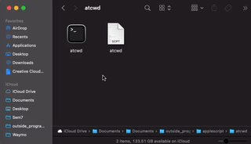

<h1 align="center">atcwd</h1>
<p>
  <a href="https://github.com/claymaks/atcwd/blob/main/LICENSE" target="_blank">
    
  </a>
</p>

> AppleScript applet made for Finder to open a terminal window in your current working directory (cwd).

<p align="center">
  
</p>

## Install

```sh
git clone git@github.com:claymaks/atcwd.git
```

## Usage

```sh
command-drag `atcwd.app` to Finder toolbar
```

## Author

👤 **Clay Maksymiuk**

* Website: https://cmaks.dev
* Github: [@claymaks](https://github.com/claymaks)
* LinkedIn: [@cmaks](https://linkedin.com/in/cmaks)

## 🤝 Contributing

Contributions, issues and feature requests are welcome!<br />Feel free to check [issues page](https://github.com/claymaks/atcwd/issues).

## Show your support

Give a ⭐️ if this project helped you!

## 📝 License

Copyright © 2021 [Clay Maksymiuk](https://github.com/claymaks).<br />
This project is [MIT](https://github.com/claymaks/atcwd/blob/main/LICENSE) licensed.

***
_This README was generated with ❤️ by [readme-md-generator](https://github.com/kefranabg/readme-md-generator)_
